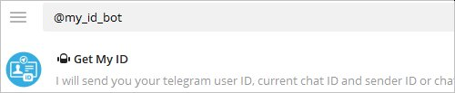
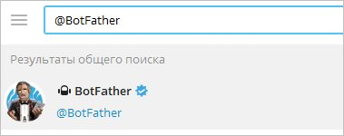

## Create telegramm bot for allerting
Оповещение будет выполнять AlertManager, который интегрируется с Prometheus. 

Открываем телеграм и ищем **@my_id_bot**  



Приложение покажет наш идентификатор. Записываем — он нам потребуется позже.  
Теперь создаем бота. Ищем **@BotFather**  



Переходим в чат с найденным BotFather и запускаем бота:

[Запускаем BotFather](img/10.jpg)

Создаем бота, последовательно введя команду **/newbot** и отвечая на запросы мастера:

[Создание нового бота в BotFather](img/11.jpg)

_* в нашем примере мы создаем бота prometheus_alert с именем учетной записи DmoskPrometheusBot._

Переходим в чат с созданным ботом, кликнув по его названию:

[Отображаем список своих телеграм ботов](img/12.jpg)

Запускаем бота:

[Стартуем созданного бота](img/13.jpg)

Попробуйте протестировать отправку из командной строки. Для этого нужно сделать запрос типа GET с синтаксисом:

```
https://api.telegram.org/bot<BotID>/sendMessage?chat_id=<ChannelName>\&text=<Text>
```

Проще всего, для этого использовать утилиту командной строки curl. Пример команды:

```
curl 'https://api.telegram.org/bot1234567890:ABCDEFGHIYKLMNOPI8e48SeTHIGfzD8W4E/sendMessage?chat_id=@dmosk_ru\&text=test'
```
_* обратите внимание, что токен передается в формате **'bot' + <token>.**_

Проверяем сообщение в телеграм канале — мы должны увидеть наше тестовое сообщение.